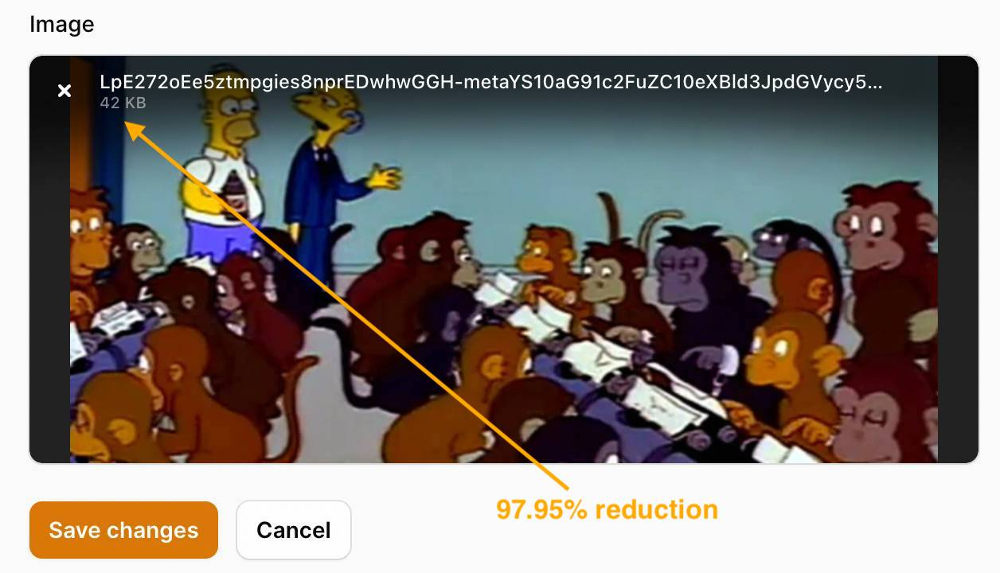

# Optimize your Filament images before they reach your database.

[](https://packagist.org/packages/joshembling/image-optimizer)
[](https://packagist.org/packages/joshembling/image-optimizer)

When you currently upload an image using the native Filament component `FileUpload`, the original file is saved without any compression or conversion.

Additionally, if you upload an image and use conversions with `SpatieMediaLibraryFileUpload`, the original file is saved with its corresponding versions provided on your model. 

What if you'd rather convert and reduce the image(s) before reaching your database/S3 bucket? Especially in the case where you know you'll never need to save the original image sizes the user has uploaded.

🤳 **This is where Filament Image Optimizer comes in**. 

You use the same components as you have been doing and have access to two additional methods for maximum optimization, saving you a lot of disk space in the process. 🎉

## Installation

You can install the package via composer:

```bash
composer require joshembling/image-optimizer
```

## Usage

### Filament version

You must be using [Filament v3.x](https://filamentphp.com/docs/3.x/panels/installation) to have access to this plugin.

### Optimizing images

Before uploading your image, you may choose to optimize it by converting to your chosen format. The file saved to your disk will be the converted version only.

E.g. I want to convert my image to 'webp': 

`````php
use Filament\Forms\Components\FileUpload;

FileUpload::make('attachment')
    ->image()
    ->optimize('webp'),
`````

You can do exactly the same using `SpatieMediaLibraryFileUpload`:

`````php
use Filament\Forms\Components\SpatieMediaLibraryFileUpload;

SpatieMediaLibraryFileUpload::make('attachment')
    ->image()
    ->optimize('webp'),
`````

### Resizing images

You may also want to resize an image by passing in a percentage you would like to reduce the image by. This will also maintain aspect ratio.

E.g. I'd like to reduce my image (1280px x 720px) by 50%:

`````php
use Filament\Forms\Components\FileUpload;

FileUpload::make('attachment')
    ->image()
    ->resize(50),
`````

Uploaded image size is 640px x 360px.

You can do the same using `SpatieMediaLibraryFileUpload`:

`````php
use Filament\Forms\Components\SpatieMediaLibraryFileUpload;

SpatieMediaLibraryFileUpload::make('attachment')
    ->image()
    ->resize(50),
`````

### Combining methods

You can combine these two methods for maximum optimization.

`````php
use Filament\Forms\Components\FileUpload;

FileUpload::make('attachment')
	->image()
	->optimize('webp')
	->resize(50),
`````

`````php
use Filament\Forms\Components\SpatieMediaLibraryFileUpload;

SpatieMediaLibraryFileUpload::make('attachment')
    	->image()
	->optimize('webp')
    	->resize(50),
`````

### Multiple images

You can also do this with multiple images - all images will be converted to the same format and reduced with the same percentage passed in. Just chain on `multiple()` to your upload:

`````php
use Filament\Forms\Components\FileUpload;

FileUpload::make('attachment')
    	->image()
	->multiple()
	->optimize('jpg')
    	->resize(50),
`````

`````php
use Filament\Forms\Components\SpatieMediaLibraryFileUpload;

SpatieMediaLibraryFileUpload::make('attachment')
    	->image()
	->multiple()
	->optimize('jpg')
    	->resize(50),
`````

### Examples 

 



## Changelog

Please see [CHANGELOG](CHANGELOG.md) for more information on what has changed recently.

## Contributing

Please see [CONTRIBUTING](.github/CONTRIBUTING.md) for details.

## Security Vulnerabilities

Please review [our security policy](../../security/policy) on how to report security vulnerabilities.

## Credits

- [Josh Embling](https://github.com/joshembling)
- [All Contributors](../../contributors)

## License

The MIT License (MIT). Please see [License File](LICENSE.md) for more information.
